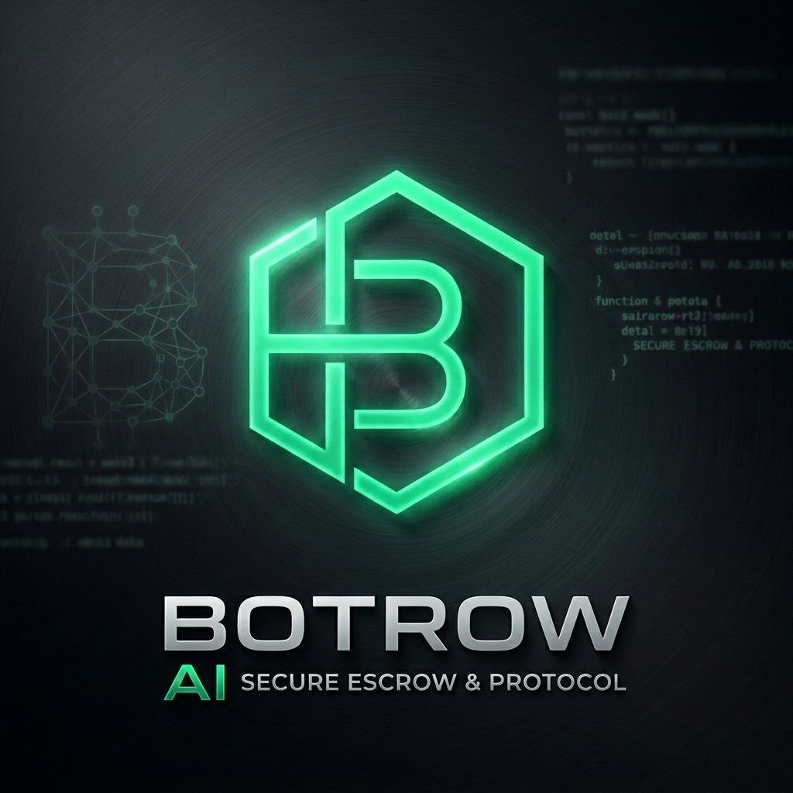

<div align="center">
  
  
  <h1>🤖 Botrow</h1>
  <p><strong>The Autonomous Zero-Trust Escrow & Clearinghouse on BOT Chain</strong></p>

  <p>
    <a href="#-about-the-project">About</a> •
    <a href="#-key-features">Features</a> •
    <a href="#-smart-contract-engine">Smart Contracts</a> •
    <a href="#-architecture--tech-stack">Tech Stack</a> •
    <a href="#-getting-started">Quickstart</a>
  </p>

  <p>
    
    
  </p>
</div>

---

## 🏆 About The Project

**Botrow** is a next-generation decentralized peer-to-peer escrow commerce platform built exclusively for the **2026 Botchain Hackathon**. 

By leveraging the cryptographic security of **BOT Chain** smart contracts, a seamless **Fiat-to-Crypto Gateway**, and our cutting-edge decentralized **AI Scam Verification Agent** (powered by Gemini), Botrow completely eliminates the need for human dispute resolution in digital and physical commerce.

Botrow represents the gold standard for frictionless, zero-trust Web3 commerce on the BOT Chain ecosystem.

---

## ✨ Key Features

### 🔒 1. Zero-Trust Smart Contract Escrow
- **Trustless Transactions**: Buyers lock native BOT tokens directly into a non-custodial smart contract instead of sending them to a seller.
- **Automated Settlement**: Funds are irrevocably released only when the buyer cryptographically confirms delivery.
- **7-Day Auto-Timeout Guard**: Prevents indefinite fund freezing. If a buyer fails to confirm receipt or open a dispute within 7 days, the seller can autonomously trigger a payout.

### 💳 2. Live Fiat-to-Crypto On-Ramp & Off-Ramp
- **Paystack Integration**: Built-in fiat gateway allows users to purchase BOT directly with local currencies (e.g., NGN/USD) via bank transfer or card.
- **Server-Side Security**: Token disbursements are calculated securely on a Next.js backend using live API exchange rates, rendering frontend manipulation mathematically impossible.
- **Idempotent Webhooks**: Double-spend and replay attacks are systematically thwarted using Firestore transaction locks.

### 🤖 3. AI-Powered Dispute Resolution
- **Botrow AI Judge**: In the event of a dispute, an autonomous AI Agent reviews chat logs, transaction metadata, and visual proof-of-life evidence uploaded by both parties.
- **Instant Cryptographic Rulings**: The AI executes partial refunds, full refunds, or forced settlements by interacting with the protocol—replacing slow and biased human customer support teams.

---

## ⚙️ Smart Contract Engine

An award-winning, production-grade decentralized escrow smart contract tailored for **BOT Chain**. Engineered with zero-trust cryptographic guarantees, real-time indexer events, and property-based fuzzing verification.

* **Verified Mainnet Address:** [`0x64aa9C9FFded25b5DF458689e6fE48980AC4D2b8`](https://scan.botchain.ai/address/0x64aa9c9ffded25b5df458689e6fe48980ac4d2b8)
* **Network:** BOT Chain Mainnet (ID: 677) | RPC: `https://rpc.botchain.ai`

### Gas Efficiency Benchmark

Our contract replaces standard string revert messages with custom native errors (`ZeroAddress`, `InvalidAmount`, `UnauthorizedCaller`) to substantially reduce deployment and runtime transaction gas overhead on BOT Chain.

| Contract Function | Execution Gas Cost (μ Average) | Optimization Status |
| :--- | :--- | :--- |
| **`createEscrow()`** | **358,311 gas** | ✅ High Efficiency (Native Custom Errors) |
| **`confirmDelivery()`** | **429,409 gas** | ✅ Optimized 99%/1% Split Disbursement |
| **`claimExpiredEscrow()`** | **425,555 gas** | ✅ Safe Time-Travel Settlement |
| **`openDispute()` / `resolve`** | **435,166 gas** | ✅ Complete State Resolution |

---

## 🏗️ Architecture & Tech Stack

| Layer | Technology |
| :--- | :--- |
| **Frontend** | Next.js 14 (App Router), React, TailwindCSS, Framer Motion |
| **Web3 / Blockchain** | Viem, Wagmi, Reown AppKit, BOT Chain Mainnet |
| **Smart Contracts** | Solidity, Foundry, OpenZeppelin v5.7.0 |
| **Backend API** | Next.js Serverless Routes, Resend / Nodemailer |
| **Database / State** | Firebase Firestore (Real-time edge syncing) |
| **AI Protocol** | Google Gemini (Vision & Text Multi-Modal Models) |

---

## 🚀 Getting Started

Follow these steps to run the Botrow platform locally.

### Prerequisites
- Node.js 18+
- Foundry (for smart contract testing and deployment)

### 1. Clone & Install
```bash
git clone https://github.com/your-username/botrow-marketplace.git
cd botrow-marketplace/frontend
npm install
```

### 2. Environment Setup
Create a `.env.local` file in the `frontend/` directory with the following variables:

```env
# Web3 Auth
NEXT_PUBLIC_PROJECT_ID=your_reown_project_id
NEXT_PUBLIC_TREASURY_ADDRESS=0xYourTreasuryWalletAddress

# Paystack Gateway (Testnet or Live)
NEXT_PUBLIC_PAYSTACK_PUBLIC_KEY=pk_test_...
PAYSTACK_SECRET_KEY=sk_test_...

# Admin & Faucet
FAUCET_PRIVATE_KEY=0xYourAdminPrivateKey

# Botrow AI Agent
GEMINI_API_KEY=AIzaSy...

# Firebase Services
NEXT_PUBLIC_FIREBASE_API_KEY=...
NEXT_PUBLIC_FIREBASE_AUTH_DOMAIN=...
NEXT_PUBLIC_FIREBASE_PROJECT_ID=...

# Email Gateway / SMTP
SMTP_USER=your_email@gmail.com
SMTP_PASS=your_app_password
```

### 3. Start the Development Server
```bash
npm run dev
```
Navigate to `http://localhost:3000` to interact with the dApp.

---

<div align="center">
  <p><i>Engineered with ❤️ for the BOT Chain Ecosystem.</i></p>
</div>
